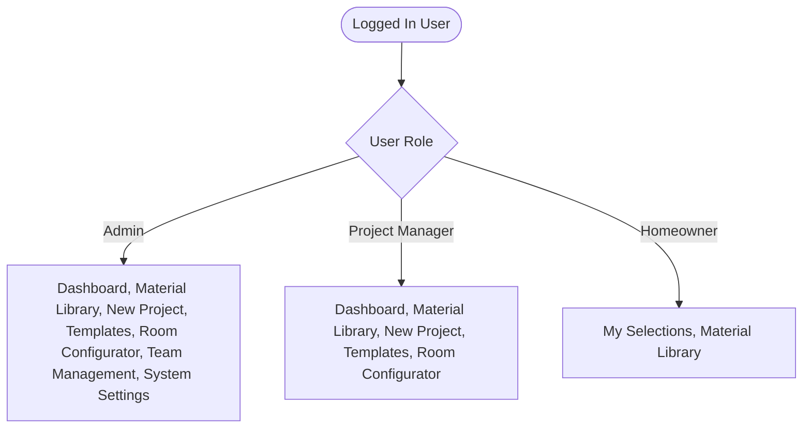
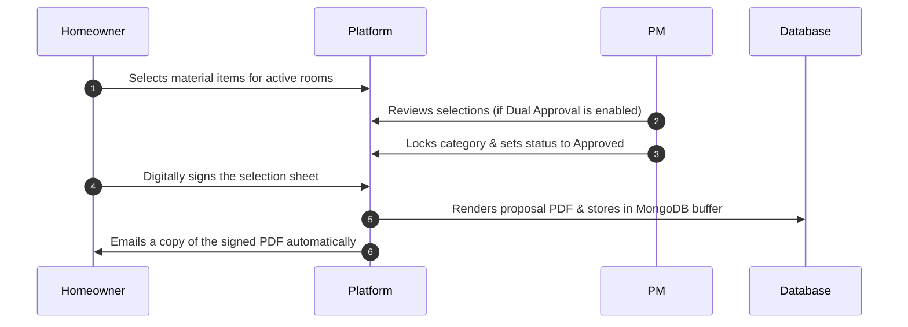

# 2BN Selections — Administrator & Builder User Guide

This guide describes the features, roles, user interfaces, and administrative workflows in the 2BN Selections platform. It focuses on the three active operational roles: **Admin (System Administrator)**, **Project Manager (Builder/Contractor Team)**, and **Homeowner (End User)**.

---

## SECTION 1: Role Profiles & System Permissions

### 1.1 Admin (System Administrator)
The Admin is the master user of the contractor organization. They possess full system configuration capabilities and are responsible for overall platform maintenance.
* **Scope of Access:** Absolute read and write access across all tables, system settings, and directories.
* **Core Duties:** 
  * Configure system-wide email settings (SMTP and Resend API keys).
  * Manage organization details (Name, slug).
  * Manage team rosters, invite employees, and administer the Recycle Bin.
  * Define and manage the global Material Library, Room templates, and Design Themes.
  * Create projects, assign Project Managers, and invite homeowners.
  * Audit, review, sign, and resend client selections or proposal copies.

### 1.2 Project Manager (PM)
The Project Manager is the day-to-day coordinator on the builder team. They set up individual projects and manage selection configurations directly with homeowners.
* **Scope of Access:** Read and write access to projects, materials, rooms, and templates. No access to the Team Directory, System Settings, or the Recycle Bin.
* **Core Duties:**
  * Create new projects, select templates, and configure customized selection sheets.
  * Invite homeowners to projects and assign selection deadlines.
  * Add custom materials to the library or assign recommendations to specific project slots.
  * Unlock specific selection categories for homeowners during deadlines.
  * Review, approve, and track client selections and Change Orders.

### 1.3 Homeowner (End User)
The Homeowner is the client for whom the home is being built. They have access only to their specific assigned project selections sheet.
* **Scope of Access:** Read-only access to the Material Library catalog. Write access limited to selecting items for active, unlocked slots on their project and signing proposals/Change Orders.
* **Core Duties:**
  * Log in securely via magic links or custom passwords.
  * Select finishes and materials for each room's selection slots.
  * Review choices and sign proposal agreements.
  * Request changes to signed categories (automatically generating Change Orders).

---

## SECTION 2: Left Sidebar & Application Routing

The navigation panel displays options dynamically based on the current user's role:

---

## SECTION 3: Detailed Page Functions & Workflows

### 3.1 Dashboard (/ or /dashboard)
The primary administrative hub. It displays an overview of all active, draft, and completed construction projects.

#### Features & Functions:
* **Metrics Dashboard:** View cards showing active project counts, pending change orders requiring action, and overall completion percentages.
* **Project List Card:** A table listing all projects with key metadata:
  * Project Name, Property Address, Client Name, and Assigned PM.
  * Selection Progress Bar (e.g., *14/20 Selections Approved*).
  * Signature Status (*Draft*, *Ready for Signature*, *Signed*, or *Locked*).
  * Lock/Unlock Toggles (allowing instant blocking of client updates).
* **Search & Filters:** Search projects dynamically by client name, address, or PM. Filter the list by status (*Active*, *Pending Signature*, *Completed*, or *Archived*).

---

### 3.2 Material Library (/library)
A master catalog containing all construction finishes, fixtures, colors, and appliances.

#### Features & Functions:
* **Master Categories/Sections:** Create high-level groupings (e.g., *Appliance*, *Flooring*, *Countertops*, *Cabinetry*, *Plumbing*). Section orders can be rearranged to define how categories display to homeowners.
* **Library Item Form:** Detail each material option:
  * **Brand/Manufacturer & Model Number:** For tracking and procurement.
  * **Level Assignment:** Assign to *Level 1 (Standard)*, *Level 2 (Semi-Custom)*, or *Level 3 (Luxury/Upgrade)*.
  * **Price Range:** Configure minimum and maximum estimated costs.
  * **Tag Recommendation System:** Assign tag descriptors (e.g., *Modern*, *Brutalist*, *Traditional*, *Coastal*). These tags match project design themes to show matching options to homeowners first.
  * **Specs & Visuals:** Upload finish images and dimension drawings, and write technical specifications.

---

### 3.3 System Settings (Admins Only) (/settings)
The configuration dashboard for system connectivity and organization details.

#### Features & Functions:
* **Organization profile:** View and edit the main company name and URL slug.
* **Email Delivery Configuration:** Provides two methods for sending automated invitations, magic login links, and signed selection sheets:
  1. **Standard SMTP:** Requires Host (e.g., `smtp.gmail.com`), Port (`587` or `465`), User, App Password, and Sender address. Bypasses IPv6 connection timeouts by forcing IPv4 resolution.
  2. **Resend HTTP API (Recommended for Render):** Sends emails over secure HTTPS (Port `443`), bypassing cloud provider outbound SMTP port blocks. Paste your Resend API key and define the verified sender domain.
* **Realtime SMTP/Resend Diagnostics:** Enter any email address and click **Send Test Email**. If the configuration fails, the screen outputs the exact error response (such as credentials rejection or DNS resolution failure) for troubleshooting.

---

### 3.4 Team Directory & Recycle Bin (Admins Only) (/team)
Manage platform access for organization employees. Only accessible by Admins. Project Managers cannot view or edit this page.

#### Features & Functions:
* **Roster List:** Displays the name, email, role, status (*Active*, *Invited*, or *Blocked*), and last login timestamp of all team members.
* **Invitation Flow:** Invite new Admins or Project Managers. Enter their email, name, and role. The server queues the invitation email asynchronously, preventing interface lag (invitation latency completes in under 100ms).
* **Recycle Bin tab:**
  * **Soft Delete:** Suspend active team members. They are immediately blocked from logging in, and their records are moved to the Recycle Bin.
  * **Restore User:** Restores the user to the active directory. If they had already set up a password, they return as `Active`; if not, they return as `Invited`.
  * **Permanent Delete:** Erase the user record completely from the database.
* **Activity Log:** View chronological logs tracking deletion, restoration, and permanent removal actions.

---

### 3.5 Room Configurator & Templates
*Paths: /room-configurator and /templates*

These tools define default selection structures so you don't have to build selection sheets from scratch for every new project:
* **Room Configurator:** Create room blueprints (e.g., *Kitchen*, *Primary Bedroom*, *Powder Room*) and add specific slots homeowners must select (e.g., *Fittings*, *Main Light Fixture*, *Tile Grout Color*).
* **Templates:** Bundle multiple configured rooms together (e.g., *3-Bed Townhouse Template*, *Luxury Custom Estate Template*). Selecting a template during project creation automatically populates the project's rooms and slots.

---

### 3.6 New Project Wizard (/projects/new)
A step-by-step setup wizard for creating homeowner projects:

1. **General Info:** Enter the project name, client name, physical property address, and select a design theme (which drives item recommendations).
2. **Template Selection:** Select a template to automatically load rooms and slots, or opt to configure rooms manually.
3. **Room Customization:** Add, clone, or delete rooms dynamically during creation.
4. **requiresDualApproval Toggle:** Toggle whether homeowner selections require contractor verification before being locked.
5. **Homeowner Invites:** Invite the homeowner by entering their email address. They receive an invitation email containing a link to set up their password.

---

### 3.7 Project Selections Sheet (Homeowner & PM Workspace)
*Path: /projects/:projectId*

The collaborative workspace where selections are made, reviewed, and signed:

#### Features & Functions:
* **Category Lock/Unlock:** PMs can lock specific categories (e.g., *Kitchen Tile*) once deadlines pass, preventing homeowners from making further changes.
* **Signatures & MongoDB PDF Buffer:**
  * Once all selections are approved, the homeowner signs the proposal using a signature pad.
  * The signed proposal PDF is compiled and saved directly into the MongoDB document. This ensures files survive cloud restarts and ephemeral storage wipes.
  * A copy of the signed PDF is automatically emailed to both the homeowner and the PM.
* **Resend Copy:** PMs can click **Resend Signed Proposal Email** to query the Mongoose buffer and resend attachments to the homeowner and team at any time.
* **Change Orders:** Any changes to signed selection slots automatically compile into a Change Order document, requiring a new signature iteration before updating the main project.
